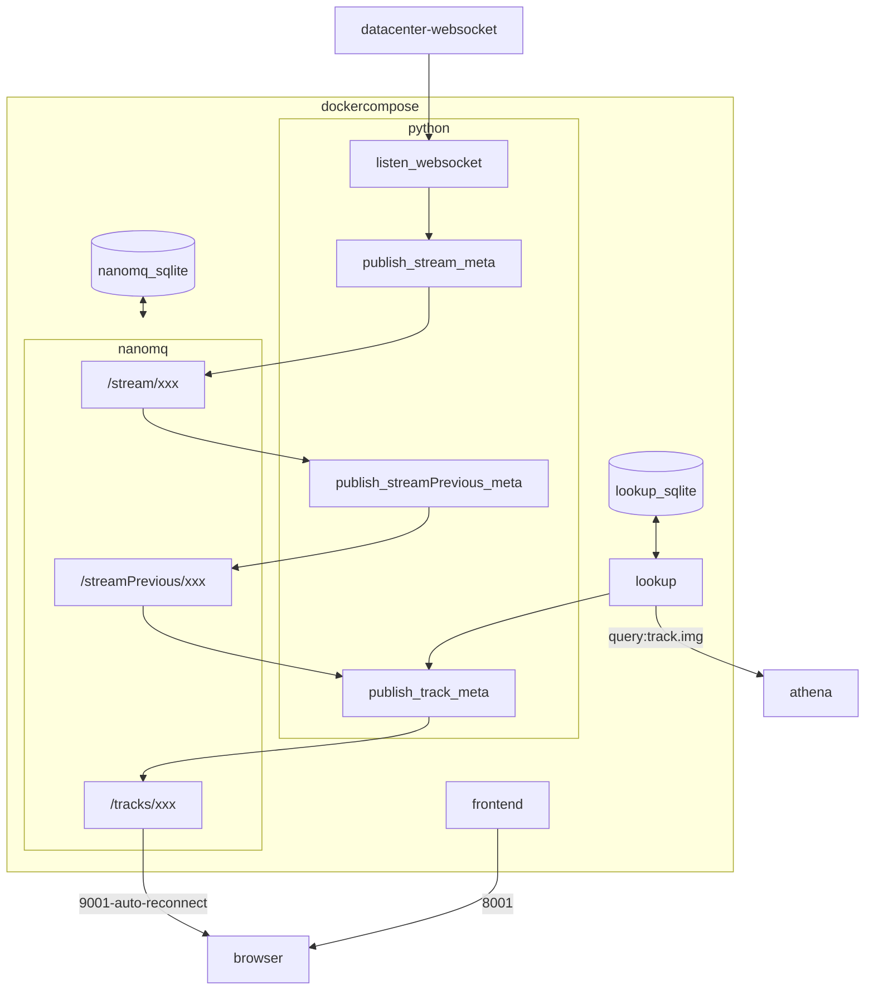

Global Live Stream Metadata
===========================

A modular resilient MQTT based Hermes replacement

Problems with Hermes
--------------------

* Ingests xxMb of binary streams to hoik out the xKb metadata payloads
* Resilience
    * If Hermes crashes, restarts or is deployed, we loose all the previous track history for all streams
    * It takes 30min? to recover the data (from a user perspective)
* We have our own custom multiple hermes-repeater python fanout layer
    * Python is maintaining 1000's of concurrent connections
        * Python is not a low level language and not efficient at this


Datacenter Websocket Datasource
-------------------------------

David Coles has created a Golang based ingester of the massive resilient multiplexed super-stream that leaves Leicester Square and arrives at the telehouse/edge
All the data packets for every stream that leaves LSQ are ingested and the stream metadata is relayed via a single websocket

http://10.7.116.20/index.html
```bash
websocat ws://10.7.116.20/metadata/ -H 'Origin: http://10.7.116.20' | jq
```

* No need for us to monitor gigabyes of binary feeds
* The resulting websocket metadata for every stream is about 300Kbps


Concept
-------

* MQTT Message Broker
    * Last message `retain`+replay
    * [nanomq](https://nanomq.io/)
        * sqllite for `retain`ed messages
        * See [benchmarks](./nanomq/nanomq.md)
            * > 5 publishers, 5 topics, 1000 subscribers (each sub to all topics)
              > Publish rate: 250/s, so sub rate = 250*1000 = 250k/s
              > QoS 1, payload 16B
              > Average pub-to-sub latency (ms) 13.91
              > NanoMQ can stably handle message throughput of up to 500k on this c5.4xlarge virtual machine.
    * Native established MQTT client libraries
        * For all platforms and languages
        * connecting, subscribing and resilient-auto-reconnecting
* Da big players use queues in there infra
    * lambdas that operate on message-queues (pub/sub)
        * Each unit has defined input/output and is testable
        * Scaleable
        * Async
        * Services and be restarted while async publishers are still publishing
        * (But now you have 'n' points of failure rather than one )


Architecture
------------



```
publish_stream_meta --> /timestamps

monitor --8000--> /timestamps
```